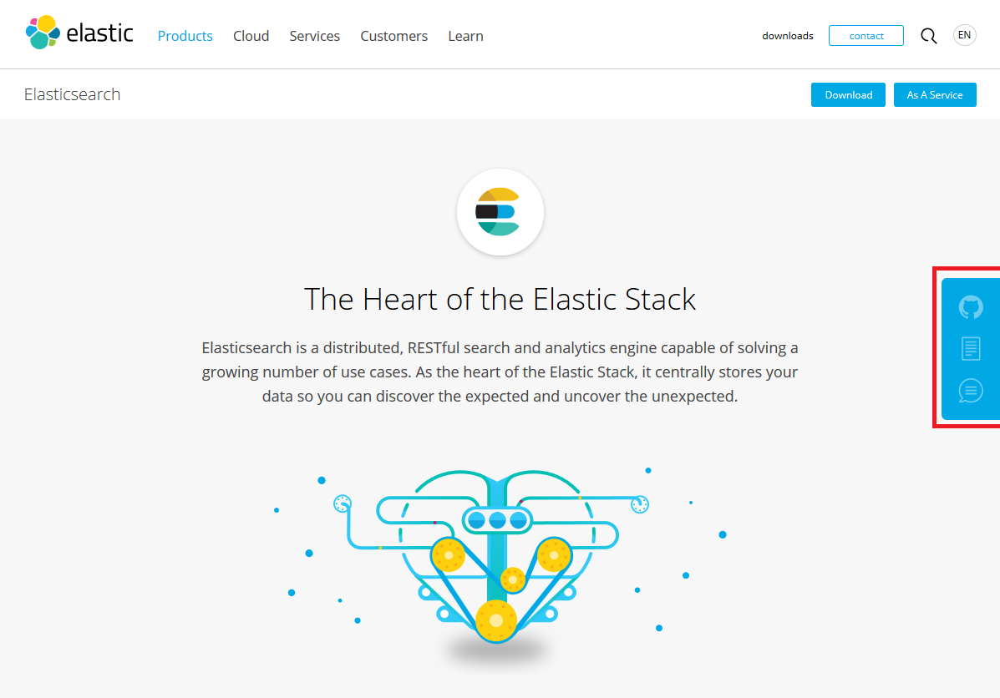

# Open Source Elastic Stack First Steps

**Table Of Contents**

* [Preface](#preface)
* [Elastic Stack Documentation](#elastic-stack-documentation)
* [Start / Installation](#start--installation)
* [Configuration](#configuration)
  * [Elasticsearch](#elasticsearch)
  * [Filebeat](#filebeat)
  * [Logstash](#logstash)
  * [Kibana](#kibana)
* [Known Issues](#known-issues)
* [Lessons Learned](#lessons-learned)


## Preface

This document is about my first steps with the [_Open Source Elastic Stack_](https://www.elastic.co/de/products) which I attend to use for the management of logging data. The most important reason for this document is the documentation of the setup work I did and not the introduction to the Elastic Stack.

Thus to understand this document you should know about the basic concepts of the Elastic Stack and its components. You can find a lot of information on these topics in the links I provided below.

## Elastic Stack Documentation

When it comes to dealing with a new technology, I always like to read some basic concepts about the technology first. Fortunately the Elastic Stack is well documented. These are the links I used a lot

* [Open Source Elastic Stack](https://www.elastic.co/products) product start page
  * [Elasticsearch](https://www.elastic.co/products/elasticsearch) - The Heart of the Elastic Stack ([RefDoc](https://www.elastic.co/guide/en/elasticsearch/reference/current/index.html))
  * [Logstash](https://www.elastic.co/products/logstash) - Centralize, Transform & Stash Your Data ([RefDoc](https://www.elastic.co/guide/en/logstash/current/index.html))
  * [Kibana](https://www.elastic.co/products/kibana) - Your Window into the Elastic Stack ([RefDoc](https://www.elastic.co/guide/en/kibana/current/index.html))
  * [X-Pack](https://www.elastic.co/products/x-pack) - One Pack. Loads of Possibilities. ([RefDoc](https://www.elastic.co/guide/en/x-pack/current/index.html))
  * [Beats](https://www.elastic.co/products/beats) - Lightweight Data Shippers ([RefDoc](https://www.elastic.co/guide/en/beats/libbeat/current/index.html))
    * [Filebeat](https://www.elastic.co/products/beats/filebeat) - Lightweight Shipper for Logs ([RefDoc](https://www.elastic.co/guide/en/beats/filebeat/current/index.html))

The product entry pages provide some overview information and on my first visit I wondered where to find the reference (product) documentation. Once noticed it is really obvious. Each product page has a litte link bar at the right side with _Docs_, _Forum_ and _GitHub_ links (seel below).



## Start / Installation

I did my first steps on Windows and the installation was mostly about extracting the archives and - after configuration - starting a batch script.

So please take a look at the [Get Started](https://www.elastic.co/start) page which will guide you through the downloads of all Elastic Stack components and follow the installation instructions of each component as described in their reference documentation (see links above).

## Configuration

### Elasticsearch

**Configuration file: [elasticsearch.yml](conf/elasticsearch.yml)**

I used the default setup of Elasticsearch and just change the path to the data store

```yml
#
# Path to directory where to store the data (separate multiple locations by comma):
#
path.data: C:/data/FooBar/elasticsearch
```

### Filebeat

Currently Filebeat it is the recommended way to forward logging data to Elasticsearch or Logstash.
In my setup I use Filebeat to send the logging data of two different applications to Logstash.

**The complete configuration can be found here:  [filebeat.yml](conf/filebeat.yml)**

As the [`filebeat prospectors`](https://www.elastic.co/guide/en/beats/filebeat/current/configuration-filebeat-options.html) are the most relevant part I am going to explain the configuration in detail here:

```yml
filebeat.prospectors:

- input_type: log
  paths:
    - C:\Progs\FooBarBackend\logs\FooBarBackend*.log
  # log4j2 pattern: %date{ISO8601}{UTC}Z | %5.5level | %15.15thread | %25.25logger{1.} | %30.30class{1.}(%4.4line) |&gt; %message | MDC=%MDC%n
  # consider lines that do not start with the date pattern to belong to the previous line
  multiline.pattern: '^[0-9]{4}-[0-9]{2}-[0-9]{2}'
  multiline.negate: true
  multiline.match: after
  # custom fields that will be used for conditional filtering in logstash
  fields:
    component: FooBarBackend
```

Above ist the configuration for the prospector that handles the log files of the **first application** (let's call it _Backend_). The [`paths`](https://www.elastic.co/guide/en/beats/filebeat/current/configuration-filebeat-options.html#prospector-paths) declaration is the pattern for the log files which should be handled. The [recommendation](https://discuss.elastic.co/t/will-filebeat-handle-properly-the-underlying-log-file-rotation/56119/4) for rolling log files seems to be to put all log files in the path ('*') and not only the "active" one.

Usually a log file entry is just a line. But in some cases (like Stacktraces or formatted data like XML or JSON) a log entry covers several lines. These should be kept together. That is where the [`multiline`](https://www.elastic.co/guide/en/beats/filebeat/current/configuration-filebeat-options.html#multiline) configuration option is needed. In my case a regular log file entry starts with a timestamp. Thus I configured the system this way: each line that does not match my timestamp pattern (pattern + negate = true) is a consecutive line of the last regular log file entry (with a timestamp in front).

And as a last important configuration option I set a custom  _component_ [`field`](https://www.elastic.co/guide/en/beats/filebeat/current/configuration-general.html#libbeat-configuration-fields) to identify the component that causes the logging entry (my backend application). I need this in logstash when transforming the log entry.

The log files of my **second application** (_Frontend_) looks very similar but considers that a different logging framework with a different timestamp pattern is used:

```yml
- input_type: log
  paths:
    - C:\Progs\\FooBarFrontend\logs\FooBarFrontend.log*
  # log4j pattern: %d{dd.MM.yy,HH:mm:ss,SSS} %-5p [%20.20t] %30.30c{1.} - %m%n 
  # consider lines that do not start with the date pattern to belong to the previous line
  multiline.pattern: '^[0-9]{2}\.[0-9]{2}\.[0-9]{2}'
  multiline.negate: true
  multiline.match: after
  # custom fields that will be used for conditional filtering in logstash
  fields:
    component: FooBarFrontend
```

To send all data to Logstash (listening on the default port) the output has to be configured as shown below

```yml
output.logstash:
  hosts: ["localhost:5044"]
```

### Logstash

A Logstash _pipeline_ includes _inputs_, _filter_ (optional) and _output_ components. These pipeline components are realized by [plugins](https://www.elastic.co/guide/en/logstash/current/working-with-plugins.html). Numerous plugins offer a rich feature selection for different use cases

```
            |------------ Logstash pipeline  -----------|

  data -->>    inputs -> filters (optional) -> outputs    -->> Elasticsearch

```

Logstash is used in my setup to filter, parse and modify the logging data that is fetched up by Filebeat before it is forwarded to Elasticsearch.

**The complete configuration can be found here:  [logstash-beats.conf](conf/logstash-beats.conf)**

As my input comes from beats I use the [beats plugin](https://www.elastic.co/guide/en/logstash/current/plugins-inputs-beats.html) to enable Logstash to receive events form the Beats framework.

```
input {
  beats {
    port => 5044
  }
}
```

The incoming data (called Logstash _event_) should be converted to proper (structured) data before it gets forwarded to Elasticsearch. Therefore a [filter](https://www.elastic.co/guide/en/logstash/5.4/pipeline.html#_filters) is used:

```
filter {

  if [fields][component] == "FooBarBackend" {

    grok {
      # log4j2 pattern: %date{ISO8601}{UTC}Z | %5.5level | %15.15thread | %25.25logger{1.} | %30.30class{1.}(%4.4line) |&gt; %message | MDC=%MDC%n
      match => { "message" => "%{TIMESTAMP_ISO8601:logtimestamp} +\| +%{WORD:level} +\| +%{DATA:thread} +\| +%{DATA:logger} +\| +%{DATA:class} \|\> +%{DATA:msg} \| +MDC=%{DATA:mdc}$" }
      add_field => { "[@metadata][index]" => "foobar-backend" }
    }

  }

  if [fields][component] == "FooBarFrontend" {

    grok {
      # log4j pattern: %d{dd.MM.yy,HH:mm:ss,SSS} %-5p [%20.20t] %30.30c{1.} - %m%n
      match => { "message" => "%{GUI_DATETIME:logtimestamp} +%{WORD:level} +\[ +%{DATA:thread}\] +%{DATA:class} - %{DATA:msg}$" }
      add_field => { "[@metadata][index]" => "foobar-frontend" }
    }

    date {
       match => [ "logtimestamp", "dd.MM.yy,HH:mm:ss,SSS" ]
       target => "logtimestamp" 
    }

  }
  
}
```

The filter section should handle _Backend_ and _Frontend_ events different. Therefore a [condition](https://www.elastic.co/guide/en/logstash/current/event-dependent-configuration.html#conditionals) on the _component_ name (which was attached as a custom field in the Beats framework) is used. 

 A [regular expression](https://www.elastic.co/guide/en/logstash/current/plugins-filters-grok.html#_regular_expressions) syntax is used in conjuction with the [match](https://www.elastic.co/guide/en/logstash/current/plugins-filters-grok.html#plugins-filters-grok-match) configuration option of the [grok](https://www.elastic.co/guide/en/logstash/current/plugins-filters-grok.html) filter plugin to split the log line into structured data (key/value pairs). 
 A variety of predefined [patterns](https://github.com/logstash-plugins/logstash-patterns-core/blob/master/patterns/grok-patterns) is available for this task.

```
>    grok {
>      # log4j2 pattern: %date{ISO8601}{UTC}Z | %5.5level | %15.15thread | %25.25logger{1.} | %30.30class{1.}(%4.4line) |&gt; %message | MDC=%MDC%n
>      match => { "message" => "%{TIMESTAMP_ISO8601:logtimestamp} +\| +%{WORD:level} +\| +%{DATA:thread} +\| +%{DATA:logger} +\| +%{DATA:class} \|\> +%{DATA:msg} \| +MDC=%{DATA:mdc}$" }
>      ...
>    }
```

The `FRONTEND_DATETIME` pattern which is used to parse the datetime of a fontend log entry is no standard pattern. But [custom patterns](https://www.elastic.co/guide/en/logstash/current/plugins-filters-grok.html#_custom_patterns) can easily be added by providing a custom text file with these patterns which needs to be located in the `logstash/patterns` application directory. I did this with the [patterns/custom](conf/patterns/custom) file. The contents looks like this

```
> FRONTEND_DATETIME %{MONTHDAY}\.%{MONTHNUM}\.%{YEAR},%{HOUR}:?%{MINUTE}(?::?%{SECOND})
```

The given grok filter above achieves that the event data has structured fields information about _timestamp_, _thread_, _logging level_, _class_ and _message_ after the filter process. This data will be relevant for the later output to Elasticsearch. 

Finding the right pattern that matches a log can be hard. The online [Grok Debugger](http://grokdebug.herokuapp.com/) is a great help on doing so.

Beside handling the given log data my filter also adds a [@metada](https://www.elastic.co/guide/en/logstash/5.4/event-dependent-configuration.html#metadata) information to a logging event. This will only be used internally and not be part of a later output. In my setup I added  the _index_ name that should be used for the Elasticsearch output of the events by using the [add_field](https://www.elastic.co/guide/en/logstash/current/plugins-filters-grok.html#plugins-filters-grok-add_field) option. _Backend_ and _Frontend_ logging data should be stored in different indices in Elasticsearch to make them accessible independently.

```
>     add_field => { "[@metadata][index]" => "foobar-backend" }
```

Last but not least I had to transfer the _logtimestamp_ data of the _Frontend_ events explicit to a date type because the custom pattern was not detected as a date value by default. I used the [date filter](https://www.elastic.co/guide/en/logstash/current/plugins-filters-date.html) for this

```
>    date {
>       match => [ "logtimestamp", "dd.MM.yy,HH:mm:ss,SSS" ]
>       target => "logtimestamp" 
>    }
```

It is important to have the correct date type here otherwise the values can not be used as a time-field later on (when working with the data in Elasticsearch / Kibana).


To complete the Logstash pipeline the [elasticsearch output plugin](https://www.elastic.co/guide/en/logstash/current/plugins-outputs-elasticsearch.html) is used.  

```
		output {
		  elasticsearch {
			hosts => "localhost:9200"
			user => elastic
			password => changeme 
			manage_template => false
			index => "%{[@metadata][index]}-%{+YYYY.MM.dd}"
			document_type => "%{[@metadata][type]}"
		  }
```

Beside the connection options also the _index_ and _document_type_ are specified. Formerly defined @metadata information is used for this.

The logging data of the two different applications will be stored with different elasticsearch indices now.

|logging data          | elasticsearch index      |
|----------------------|--------------------------|
|Backend Application   |foobar-backend-YYYY.MM.dd |
|Frontend Application  |foobar-frontend-YYYY.MM.dd|

### Kibana

**Configuration file: [kibana.yml](conf/kibana.yml)**

I used the default setup of Kibana. I only changed the `server.host` value from _localhost_ to _0.0.0.0_ to allow remote connections.

```yml
# Specifies the address to which the Kibana server will bind. IP addresses and host names are both valid values.
# The default is 'localhost', which usually means remote machines will not be able to connect.
# To allow connections from remote users, set this parameter to a non-loopback address.
#server.host: "localhost"
server.host: "0.0.0.0"
```

Because of the setup I can now declare the following index patterns in Kibana

|Kibana Index Patterna | affects logs of                  |
|----------------------|----------------------------------|
|foobar-*              | backend and frontend application |
|foobar-backend-*      | the backend application          |
|foobar-frontend-*     | the frontend application         |

Discovering of log entries for both or individual applications works great ;-)

## Known-Issues

* multiline log entries are grouped together to one log event but the extracted `msg` content contains only the message of the first line (the rest ist hidden in the `source` attribute of the logging data which is sent to Elasticsearch)

## Lessons Learned

  * treating each logging source (application) individually is hard and error-prone
    * consider to use a common logging framework with a common Pattern Layout for each application of a system
    * consider to use log file names which can be used as template for the Elasticsearch index; the log file name is part of the _source_ log event data an can propably be used to generate a automatic index name
      * index name must be all lowercase ([see here](https://www.elastic.co/guide/en/elasticsearch/reference/5.4/_basic_concepts.html#_index))
  * ...

  * License
    * see [Subscriptions](https://www.elastic.co/subscriptions)
    * using the Monitoring feature of X-Pack requires a free license which needs to be renewed every year

    